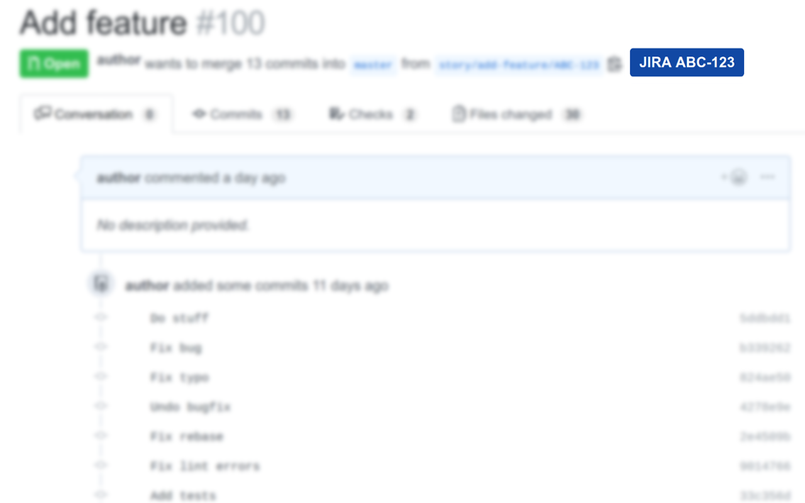

# GitHub-Jira Link

GitHub-Jira Link is a Chrome and Firefox extension that uses the branch name on a GitHub pull request page to add a link to the Jira issue corresponding to the pull request. In order for it to work, Jira ticket number must appear in the branch name, the pull request title, or the first comment on the pull request page. For example, for the branch name `story/add-feature/ABC-123`, the extension will add a link to the Jira issue with ticket number `ABC-123`.

## Installation

### [Chrome](https://chrome.google.com/webstore/detail/github-jira-link/npfkglcfelgebbampcngijkklhocgfia)

### [Firefox](https://addons.mozilla.org/en-US/firefox/addon/github-jira-link/)

## Setup

1. Click on the GitHub-Jira-Link icon next to the address bar.
1. Enter your GitHub organization name (the string after `github.com/` in a pull request URL).
1. Enter your GitHub repo name (the string after the GitHub organization name in a pull request URL).
1. Enter your Jira organization name (the string before `.atlassian.net` in a Jira ticket URL).
1. Enter the Jira ticket prefix (the letters before `-` in the ticket number).
1. Click 'Save'.

## [Contributing](./CONTRIBUTING.md)

## [License](./LICENSE)
